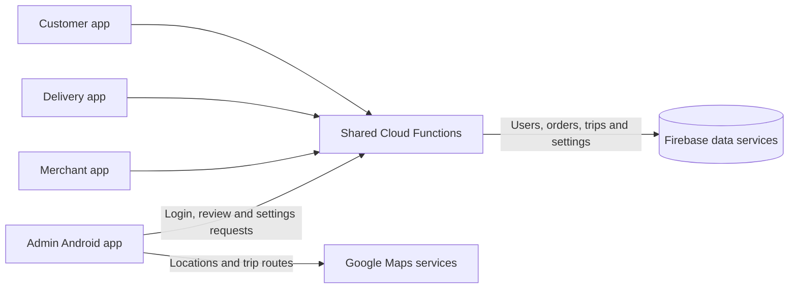

# Laundromat Admin

The administrator Android app for **Laundromat**, my 2021 BSc Software Engineering final-year project at the International Islamic University Islamabad. It brings merchant and rider registration review, user records, orders, trips, service types, transactions, and system settings into one interface.

## What the admin app does

| Area | Client behavior |
| --- | --- |
| Registration review | View pending merchant and rider applications, including laundry or vehicle details and submitted images. Accept or decline a request after checking whether it has already been handled. |
| People and businesses | Search and inspect customer, merchant, and rider profiles. Edit their details, laundry information, vehicle details, and vehicle images through the relevant profile screens. |
| Orders and trips | Search orders and trips, filter them by status, and inspect order items, payment and fare details, customer and merchant contacts, rider and vehicle details, trip status, and map routes. |
| Services | Add a laundry service type and view the items and laundries offering that service. |
| Transactions | Browse a combined transaction list from customers, merchants, and riders. Individual profiles also show their related transactions. |
| Settings and overview | View counts for registration requests, users, orders, trips, transactions, service types, and listed items, plus the dashboard's total-revenue figure. Update the admin email, base fare, per-kilometre charge, and delivery radius. |

## Admin workflow

1. Sign in with an administrator account provided by the shared backend. The app loads pending requests, users, orders, and service types before opening the dashboard.
2. Review new merchant applications with their laundry information, or rider applications with their vehicle information. Accept or decline each request.
3. Browse customer, merchant, and rider records. Open a profile to inspect associated information and use its edit controls when needed.
4. Search or filter orders and trips by status, then open a record for its details and related contacts.
5. Add service types or adjust fare and delivery-radius settings used across the Laundromat apps.

The dashboard derives its counts from the records loaded by the backend and calculates its revenue figure from selected transaction types.

## How it is built

- **Platform:** native Android with Java 8 language features, XML layouts, and Material Components.
- **Build:** Gradle 6.7.1 wrapper, Android Gradle Plugin 4.2.2, API 30 for compile/target, and API 23 (Android 6.0) as the minimum.
- **Backend:** Firebase callable Cloud Functions for administrator login, registration decisions, data retrieval, profile changes, service types, and settings.
- **Maps and media:** Google Maps and Places for location and trip views, an image picker for profile and vehicle images, and Picasso for image display.

The app uses `admin-verifyLogin` for its username/password login. Other calls include `admin-getNewRegistrationRequests`, `admin-checkRequestHandled`, `admin-acceptRegistrationRequest`, `admin-declineRegistrationRequest`, `admin-getOrders`, `admin-addServiceType`, and `admin-updateSettings`. The callable functions are in the [shared Cloud Functions repository](https://github.com/taymoor-ghazanfar/laundromat-cloud-functions).



Activities cover the dashboard and record-detail screens. Fragments and dialogs handle profile pages, edits, filters, and registration review. Models represent the same merchant, laundry, rider, customer, order, trip, and transaction data used by the other apps. The list screens search and filter the data loaded into the admin session, with refresh actions to fetch current records.

### Repository layout

```text
app/
  build.gradle                  Android app configuration and dependencies
  src/main/AndroidManifest.xml  Activities, permissions, and Maps configuration
  src/main/java/com/laundromat/admin/
    activities/                Dashboard, requests, profiles, orders, trips, settings
    dialogs/, fragments/       Filters, profile edits, and review pages
    model/                     Users, laundries, services, orders, trips, transactions
    prefs/                     Local admin session preferences
    ui/                        Adapters, view holders, and custom views
    utils/, helpers/           Validation, parsing, location, and route helpers
  src/main/res/                Layouts, strings, themes, icons, and animations
firebase.json                  Firebase Hosting, Firestore, and Storage configuration
firestore.rules, storage.rules Firebase rules files
y/                             Firebase Hosting files
gradle/wrapper/                Gradle wrapper
```

## Build and run

### Prerequisites

- Android Studio with Android SDK and Build Tools for API 30, and a JDK compatible with the included Gradle configuration.
- An Android device or emulator running Android 6.0 (API 23) or later with Google Play services.
- A Firebase project with the shared callable functions deployed and an administrator record for `admin-verifyLogin`. Configure the Maps, Places, and Directions services used by the app.

1. Clone the repository and open its root directory in Android Studio.
2. Supply Firebase Android configuration for application ID `com.laundromat.admin` in `app/google-services.json`.
3. Configure `google_maps_api_key` and `google_api_key` in `app/src/main/res/values/strings.xml` for Maps, routes, and Places.
4. Deploy the shared backend functions and provide the administrator account and settings data expected by that backend.
5. Select the app run configuration in Android Studio, or run `./gradlew :app:assembleDebug` (`.\gradlew.bat :app:assembleDebug` on Windows). Install the debug APK on a device or emulator.

The manifest requests internet, camera, storage, and location access for network data, image selection, and map-related screens.

## Related repositories

- [Customer app](https://github.com/taymoor-ghazanfar/laundromat-customer) — laundry discovery, booking, and order tracking.
- [Merchant app](https://github.com/taymoor-ghazanfar/laundromat-merchant) — catalog and order management.
- [Delivery app](https://github.com/taymoor-ghazanfar/laundromat-delivery) — trip requests, navigation, and handovers.
- [Admin app](https://github.com/taymoor-ghazanfar/laundromat-admin) — approvals and system administration (this repository).
- [Cloud Functions](https://github.com/taymoor-ghazanfar/laundromat-cloud-functions) — shared backend operations and notifications.

## Academic context and license

Developed by **Taymoor Ghazanfar**, supervised by **Dr. Muhammad Nadeem**, International Islamic University Islamabad (2021).

The repository includes an [Apache License 2.0](LICENSE) file.
